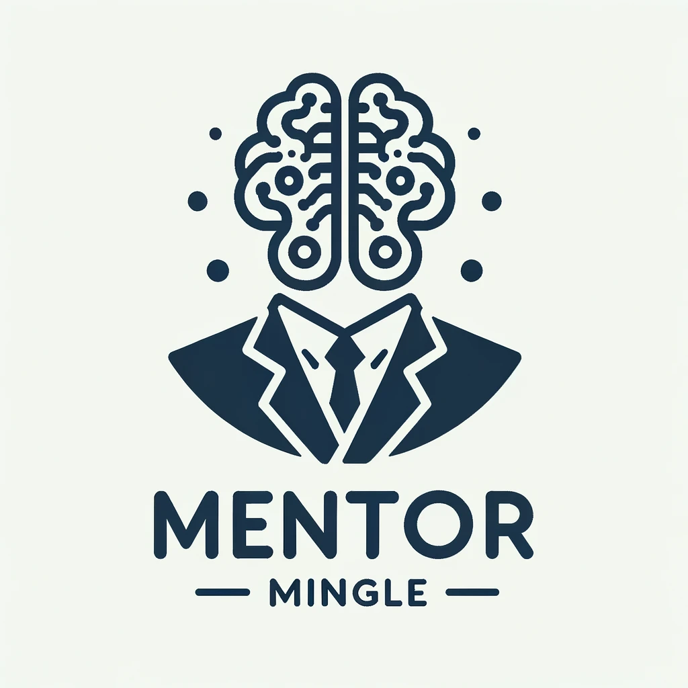

# Mentor Mingle - An AI Agent for Interview Preparation

## Introduction
[](https://opensource.org/licenses/MIT)
[](https://codecov.io/gh/aymanehachcham/mentor-mingle)

Mentor Mingle is an AI agent that helps you prepare for your next interview. It is a chatbot that can answer your questions about a company, a job role, or a specific interview question. It can also help you practice your interview skills by conducting a mock interview with you. 
It can also help you prepare for your interview by giving you a list of questions that you can practice answering.



## Install

Clone the repository and install the dependencies using the following commands:

```bash 
git clone https://github.com/aymanehachcham/mentor-mingle.git
cd mentor-mingle
pip install -r requirements.txt
```
## Documentation

Will follow shortly.
